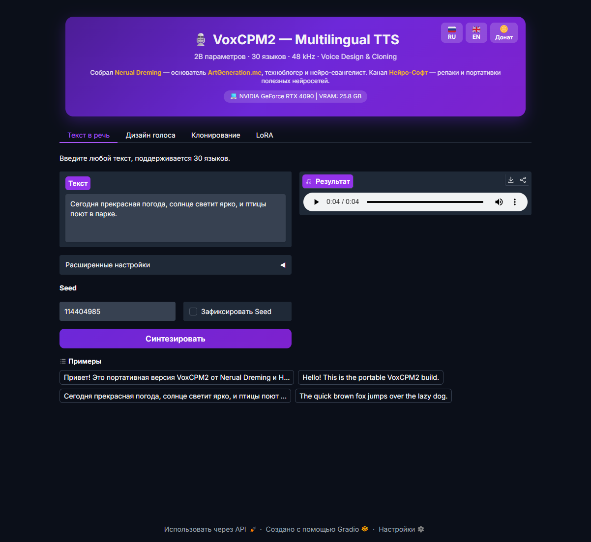

<div align="center">



# VoxCPM2 Portable

**Portable Windows build of VoxCPM2 — multilingual TTS with Voice Design, Cloning & end-to-end LoRA fine-tuning (video/audio → dataset → training).**

[](https://github.com/timoncool/VoxCPM2_portable/stargazers)
[](LICENSE)
[](https://github.com/timoncool/VoxCPM2_portable/commits/main)
[](https://github.com/timoncool/VoxCPM2_portable/releases)

**[Русская версия](README_RU.md)**

</div>

Generate natural multilingual speech, design brand-new voices from text descriptions, clone any voice from a reference clip, and **train your own LoRA straight from a video or audio file** — upload 8 minutes of a podcast and the app slices it into clips, auto-transcribes, picks the optimal training parameters and starts the run. **100% local**, no cloud, no API keys. One-click install on Windows, runs on any NVIDIA GPU with 8+ GB VRAM.

Built on [VoxCPM2](https://huggingface.co/openbmb/VoxCPM2) by OpenBMB — a tokenizer-free 2B-parameter diffusion autoregressive TTS model trained on 2M+ hours of speech.

## Why VoxCPM2 Portable?

- **Free forever** — no API keys, no credits, no usage limits
- **Private** — your voice data never leaves your machine
- **Portable** — everything in one folder, copy to USB, delete = uninstall
- **One-click** — `install.bat` → `run.bat` → generate speech
- **30 languages** — Russian, English, Chinese, French, German, Japanese, Korean and more
- **Auto-dataset from video/audio** — drop a long file, the app does ffmpeg → ASR → VAD → sentence-aware splitting → optimal params → training, all on its own

## Features

### Text-to-Speech
- **30 languages** — RU/EN/ZH (+9 Chinese dialects)/AR/FR/DE/HI/IT/JA/KO/PT/ES + more — auto language detection
- **48 kHz studio output** via AudioVAE V2 super-resolution (16→48 kHz)
- **Natural prosody** — tokenizer-free diffusion autoregressive architecture
- Output formats: **MP3** (default), WAV, FLAC, OGG
- **Autoplay** — generated clip starts playing immediately

### Voice Design
- Create voices from **text description** — gender, age, tone, emotion, pace, accent
- Zero-shot — no reference audio needed
- 6 ready-made examples (EN+RU) with one-click fill

### Voice Cloning (with optional Ultimate mode)
- Clone any voice from **5-50 seconds** of reference audio
- **Voice pack** bundled (~100 voices, RU/EN/FR/DE/JP/KR/AR)
- Extra **743 Russian voices** on-demand from `Slait/russia_voices`
- Style control: `slightly faster, cheerful tone` / `whispering, intimate` / `slow and dramatic`
- **Ultimate mode** — fill the transcript field → model uses `prompt_wav_path + prompt_text + reference_wav_path` for max fidelity
- Optional **ZipEnhancer denoise** for noisy references

### LoRA Fine-Tuning — Auto Pipeline 🎬
Train a LoRA on a whole video or podcast in a single click:
1. **Drop a video/audio file** (mp4/mkv/webm/mov/mp3/wav/flac/…)
2. ffmpeg extracts audio → 16 kHz mono WAV
3. **Parakeet TDT 0.6B v3 INT8 ONNX** (NVIDIA NeMo, ~670 MB, 25 European languages incl. Russian) + **Silero VAD** transcribe with word-level timestamps, handles any length
4. Words are grouped into **whole sentences** by punctuation, short ones get merged, long ones split at commas/pauses — **never mid-word**
5. Clips saved to `train_data/<name>/audio/clip_NNNN.wav` + `transcripts.txt`
6. **Auto-tune** picks `r / alpha / steps / lr` from minutes of clean speech (official OpenBMB table)
7. Training starts in the same click (if the checkbox is on)

Typical result for 8 min of speech: ~69 clips, 86 % extraction rate, ~14 min of training on RTX 4090.

### LoRA Fine-Tuning — Manual Mode
For pre-cleaned datasets:
- Upload 5-50 WAV/MP3 clips (3-15 sec each) + transcripts in `filename.wav|text` format
- Defaults match the **official OpenBMB YAML** (`voxcpm_finetune_lora.yaml`): `r=32, alpha=32, steps=1000, lr=1e-4`
- Live training log, auto-cleanup of old checkpoints on re-runs
- **Hot-swap** LoRAs across all modes without restart

### All model parameters exposed
CFG Scale · Inference Steps · Min/Max length · Retry-on-bad-case · Retry max attempts · Retry ratio threshold · Text normalization (wetext) · Denoise reference · Streaming (live progress) · Seed + Lock

### Interface
- **i18n RU/EN** — RU/EN buttons in the header for instant switch
- **Dark theme** with gradient header
- **Bundled FFmpeg** portable (for MP3/OGG encoding)
- **Auto-download** — VoxCPM2 model (~4-5 GB) + voice pack + ASR model (~670 MB, lazy) on first use
- **Auto-port, auto-browser** — opens on `localhost` automatically

### GPU Accelerators (out of the box)
| GPU | Flash Attention 2 | SDPA flash | bfloat16 | AMP (training) | ONNX CUDA (ASR) |
|-----|:---:|:---:|:---:|:---:|:---:|
| RTX 30xx / 40xx / 50xx | ✅ | ✅ | ✅ | ✅ | ✅ |
| GTX 10xx / RTX 20xx | ❌ | ✅ | ✅ | ✅ | ✅ |

## System Requirements

| Component | Minimum | Recommended |
|-----------|---------|-------------|
| GPU VRAM | 8 GB | 12+ GB |
| RAM | 16 GB | 32 GB |
| Disk | 15 GB | 30 GB (with voice pack & LoRA) |
| OS | Windows 10/11 | Windows 11 |
| GPU | RTX 2080 / RTX 3060 | RTX 4070+ |

CPU-only mode supported but **very slow** (minutes per phrase).

## Quick Start

### 1. Clone
```bash
git clone https://github.com/timoncool/VoxCPM2_portable.git
cd VoxCPM2_portable
```

### 2. Install
```
install.bat
```
Select your GPU type (6 options). Installs portable Python 3.12 + PyTorch 2.7.1 + voxcpm + Flash Attention 2 + FFmpeg + onnx-asr + default voice pack. Nothing system-wide.

### 3. Run
```
run.bat
```
Browser opens automatically. Model downloads on first run (~4-5 GB to `models/`). Parakeet ASR (~670 MB) is fetched only when you click **Auto-prepare dataset**.

## Launchers

| Script | Description |
|--------|-------------|
| `install.bat` | One-click installer — Python + PyTorch + voxcpm + accelerators + FFmpeg + onnx-asr + voice pack |
| `run.bat` | Launch Gradio UI with full environment isolation |
| `update.bat` | Update portable wrapper + voxcpm package |

## LoRA Training — Full Guide

### Option A — Auto from video/audio (recommended)

1. Open the **LoRA** tab
2. Enter the **Dataset / LoRA name** (used for both `train_data/<name>/` and `lora/<name>/`)
3. Go to the **🎬 Auto** sub-tab
4. Drop your video or audio file (mp4, mkv, webm, mp3, wav, flac, m4a, ogg, opus, …)
5. Leave **🤖 Auto-tune** on (picks r / α / steps / lr from minutes of clean speech)
6. Check **Start training after dataset is ready** if you want it to train without a second click
7. Hit **🎬 Auto-prepare**

The app streams a log with each stage: ffmpeg extract → Parakeet transcription → segmentation → clip save → training. Final LoRA checkpoint lands in `lora/<name>/step_XXXX/` and is immediately available in the LoRA dropdown across all tabs.

### Option B — Manual

1. Prepare your clips (5-50 WAV/MP3, 3-15 sec each) + transcripts in `filename.wav|text` format, one per line
2. Switch to the **🎓 Manual** sub-tab in the LoRA tab
3. Upload files and paste transcripts
4. Optionally tweak r / α / steps / lr sliders (defaults are the official OpenBMB values)
5. Hit **🎓 Start training**

### Recommended settings — auto-tuned from minutes of clean speech

The app computes `steps = target_epochs × n_clips / effective_batch`, rounded to 50, and picks `grad_accum` adaptively (4 for < 200 clips, 8 for < 500, 16 for 500+). Table of target epochs:

| Clean speech | target epochs | r / α | lr |
|---|---|---|---|
| < 2 min | 25 (⚠ below OpenBMB minimum) | 32 / 32 | 1e-4 |
| 2-5 min | 20 | 32 / 32 | 1e-4 |
| **5-10 min** (sweet spot) | **15** | **32 / 32** | **1e-4** |
| 10-20 min | 12 | 32 / 32 | 1e-4 |
| 20-60 min | 8 | 32 / 32 | 1e-4 |
| 60-120 min | 5 | 64 / 64 | 5e-5 |
| 120+ min | 3 | 64 / 64 | 5e-5 |

For 69 clips / 7.6 min (typical 8 min podcast) → 250 steps → **≈3-4 min of training on RTX 4090**.

### Activating a trained LoRA

- In any tab (TTS / Voice Design / Voice Cloning) expand **Advanced settings**
- Pick your LoRA in the **🧬 LoRA** dropdown
- First activation takes ~30-60 sec (model reloads with the LoRA r/α structure)
- Subsequent switches are instant hot-swap

## Architecture

```
VoxCPM2_portable/
├── app.py              # Gradio UI (4 tabs: TTS / Voice Design / Cloning / LoRA)
├── install.bat         # GPU selector + installer
├── run.bat             # Launcher with env isolation
├── update.bat          # Updater
├── requirements.txt    # Python dependencies
├── training/
│   ├── scripts/        # Official OpenBMB train & inference scripts (bundled)
│   └── conf/           # YAML config templates
├── python/             # Portable Python 3.12 (created by install.bat)
├── models/             # HuggingFace cache (VoxCPM2 ~4-5 GB, Parakeet ~670 MB, Silero VAD, …)
├── voices/             # Voice pack (bundled default ~100 voices + user downloads)
├── lora/               # Trained LoRA checkpoints (lora/<name>/step_XXXX/)
├── train_data/         # User LoRA datasets (audio + transcripts)
├── ffmpeg/             # Portable FFmpeg (for MP3/OGG encoding)
├── output/             # Generated audio files with timestamps
├── cache/ / temp/      # General cache / tempdir
```

## Updating

```
update.bat
```

## Links

- [OpenBMB / VoxCPM](https://github.com/OpenBMB/VoxCPM) — original project
- [VoxCPM2 model card](https://huggingface.co/openbmb/VoxCPM2) — weights
- [Demo page with audio samples](https://openbmb.github.io/voxcpm2-demopage/)
- [Fine-tuning Guide](https://voxcpm.readthedocs.io/en/latest/finetuning/finetune.html)
- [Parakeet TDT 0.6B v3 (multilingual ASR)](https://huggingface.co/nvidia/parakeet-tdt-0.6b-v3)
- [onnx-asr](https://github.com/istupakov/onnx-asr) — Python wrapper used for Parakeet

## Other Portable Neural Networks

| Project | Description |
|---------|-------------|
| [ACE-Step Studio](https://github.com/timoncool/ACE-Step-Studio) | Local AI music generation studio |
| [Foundation Music Lab](https://github.com/timoncool/Foundation-Music-Lab) | Music generation + timeline editor |
| [VibeVoice ASR](https://github.com/timoncool/VibeVoice_ASR_portable_ru) | Speech recognition (ASR) |
| [LavaSR](https://github.com/timoncool/LavaSR_portable_ru) | Audio quality enhancement |
| [Qwen3-TTS](https://github.com/timoncool/Qwen3-TTS_portable_rus) | Text-to-speech by Qwen |
| [SuperCaption Qwen3-VL](https://github.com/timoncool/SuperCaption_Qwen3-VL) | Image captioning |
| [VideoSOS](https://github.com/timoncool/videosos) | AI video production |
| [RC Stable Audio Tools](https://github.com/timoncool/RC-stable-audio-tools-portable) | Music and audio generation |

## Authors

Built by **[Nerual Dreming](https://t.me/nerual_dreming)** — founder of **[ArtGeneration.me](https://artgeneration.me)**, tech-blogger and neuro-evangelist. Channel **[Нейро-Софт](https://t.me/neuroport)** — portable builds of useful AI tools.

## Acknowledgments

- **[OpenBMB / VoxCPM team](https://github.com/OpenBMB/VoxCPM)** — open source VoxCPM2 model
- **[NVIDIA NeMo / Parakeet TDT](https://huggingface.co/nvidia/parakeet-tdt-0.6b-v3)** — multilingual ASR
- **[istupakov/onnx-asr](https://github.com/istupakov/onnx-asr)** — ONNX wrapper for Parakeet + Silero VAD
- **[Slait/russia_voices](https://huggingface.co/datasets/Slait/russia_voices)** — 743 Russian voice presets
- **[lldacing/flash-attention-windows-wheel](https://huggingface.co/lldacing/flash-attention-windows-wheel)** — Windows Flash Attention 2 wheels
- **[Gradio](https://gradio.app/)** — UI framework
- **[FFmpeg](https://ffmpeg.org/)** — audio encoding

## Support Open-Source AI

Hi! I'm Ilya ([Nerual Dreming](https://t.me/nerual_dreming)), and I build AI tools that anyone can run locally — for free, without cloud, without subscriptions. Your donation lets me focus on research and building new open-source projects instead of surviving. Thank you!

**[All methods (Card / PayPal / Apple Pay)](https://dalink.to/nerual_dreming)** | **[Monthly on Boosty](https://boosty.to/neuro_art)**

- **BTC:** `1E7dHL22RpyhJGVpcvKdbyZgksSYkYeEBC`
- **ETH (ERC20):** `0xb5db65adf478983186d4897ba92fe2c25c594a0c`
- **USDT (TRC20):** `TQST9Lp2TjK6FiVkn4fwfGUee7NmkxEE7C`

---

## Star History

<a href="https://www.star-history.com/?repos=timoncool%2FVoxCPM2_portable&type=date&legend=top-left">
 <picture>
   <source media="(prefers-color-scheme: dark)" srcset="https://api.star-history.com/svg?repos=timoncool/VoxCPM2_portable&type=date&theme=dark&legend=top-left" />
   <source media="(prefers-color-scheme: light)" srcset="https://api.star-history.com/svg?repos=timoncool/VoxCPM2_portable&type=date&legend=top-left" />
   
 </picture>
</a>
</content>
</invoke>